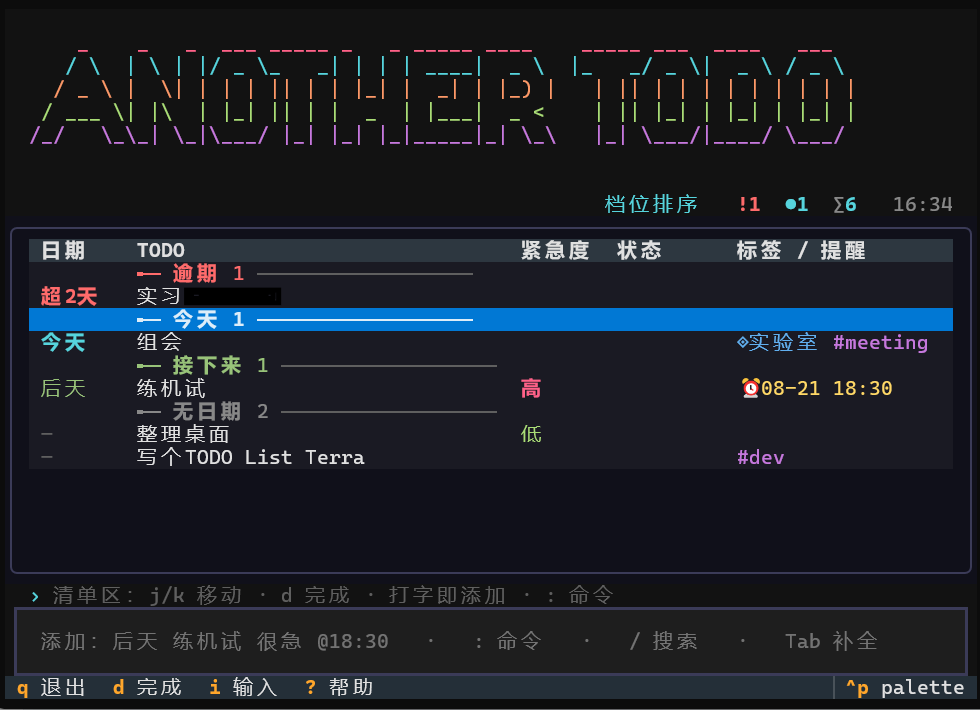

# anothertodo (`atd`)



**中文 README** · [English README](README.en.md)

轻量 todo：一行模糊输入添加任务，命令行 TUI 管理，提醒 hook 通知，git 多端同步。数据是纯文本 JSONL，存在 `~/.atd/`。

> 完整功能与案例见 **[VitePress 文档站](https://meredith2328.github.io/anothertodo/)**。本 README 是速查。

## 安装

**Node.js**：需要 Node.js 22+，从源码安装：

```bash
npm ci
npm run build
npm link
```

**独立可执行文件（推荐，无需安装任何东西）**：从 GitHub Releases（`node-v*` tag）下载对应平台的单文件程序——Windows 直接双击 `atd-windows.exe` 进入 TUI；macOS/Linux `chmod +x` 后运行。数据仍存 `~/.atd`，纯文本 JSONL、格式稳定，两种安装方式共用同一份数据；数据目录首次运行自动创建。

## 快速上手

**命令行**：

```bash
atd add "后天 买牛奶 很急 @18:30"   # 一行添加：日期/紧急度/提醒全解析
atd list                          # 逾期/今天/接下来/等待/无日期 分组
atd done 3fbd                     # 完成任务（id 前几位即可）
atd undo                          # 撤销上一步
```

**TUI**（直接敲 `atd`）：

```
直接打字 = 添加（下方实时解析预览）   j/k 移动 · PgUp/PgDn 翻页 · g/G 首末
d 完成 · x 删除（先确认）· c 取消 · o 重新打开 · e 编辑 · w 等到明天 · s 提醒推迟 10 分钟
l / → 详情浮层（备注、提醒、父子任务；浮层里 j/k 翻、e 编辑）
空格 打勾多选 · Ctrl+A 全选本屏 · 有勾选时 d x c w o s 批量执行 · Esc 先清多选再预备退出
: list/undo/sync/mode/archive/cancel/meeting/todo/wait <日期>/snooze <分钟>
/ 搜索 · ? 帮助 · u 撤销 · 1/2 切排序 · t 切日期列 · q/双击 Esc 退出
```

用 `^父id` 记的子任务会在列表和 TUI 里缩进排在父任务下面（支持多层）；完成父任务时会点名报出还没完成的子任务，删除父任务时会提示哪些子任务变成了孤儿。

## 一行输入魔法

日期、时间、紧急度、标签、提醒，混写在一行里自动解析，剩下的是标题：

```bash
atd add "周五 18:30 例会 #工作 proj:日常"       # 最近周五 18:30 + 标签/项目
atd add "买礼物 明天 >>她说想要那个手账本，别买错型号"   # >> 之后到行尾整段是备注
atd add "倒垃圾 *每天 晚上8点"                  # 每天重复
atd add "交房租 *每月 月初"                     # 每月重复，锚在月初
atd add "等回复 ~下周一 高"                     # 押后到下周一才浮出 + 档位
atd preview "后天 下午2点半 复盘 特急"           # 先看解析结果再添加
```

| 你写 | 解析为 |
|---|---|
| `明天` `后天` `周五` `下周一` `月底` `8.20` | 各种日期（数字过期保持字面） |
| `today` `tomorrow` `tonight` `next fri` `this weekend` | 英文日期（tomorrow 默认上午 10 点，next 指下一周） |
| `晚上8点` `下午3点半` `14:30` `2:30pm` `9am` | 时间（无日期则顺延明天；支持 12 小时制） |
| `很急` `特急` `urgent` `very urgent` → 高；`一般` `normal` → 中；`不急` `no rush` → 低 | 紧急度短语（`Sol` 等档位名也行；英文短语带词边界） |
| `#标签` `proj:项目` `^父id` `~周五` `~next monday` | 标签 / 项目 / 子任务 / wait（含多词英文日期） |
| `@18:30` `@9:00:toast,email` `@30m` | 提醒（锚定任务日期，可多 hook） |
| `>>备注内容` | `>>` 之后到行尾整段是备注，里面的 `#` `@` `proj:` 日期都不再解析；单写 `>>` 表示清空备注 |

用 `*` 写重复规则：

| 写法（中英文都认） | 含义 |
|---|---|
| `*每天` / `*daily` / `*1d` | 每天 |
| `*每2周` / `*2w` | 每两周 |
| `*每周三` / `*weekly:wed` | 每周三 |
| `*每月` / `*monthly` | 每月 |
| `*每年` / `*yearly` | 每年 |
| `*工作日` / `*weekdays` | 每个工作日（跳过周末） |

重复任务完成时会另开一条新任务（新 id），截止日期、等待日期、提醒时间整体往后平移，原任务保留在历史里。按月推进时 31 号遇上短月会压到月末（1 月 31 日 → 2 月 28 日），不会滚到下个月。

`edit` 吃同一套一行输入，而且现在能清空字段（以前只能覆盖，加错的日期删不掉），例如 `atd edit a1b2 "-due -#临时"`：

| 写法 | 含义 |
|---|---|
| `-due` / `-日期` | 清掉截止时间 |
| `-proj` / `-项目` | 清掉项目 |
| `-标签` / `-tags` | 清掉全部标签 |
| `-#某标签` | 只摘掉这一个标签 |
| `-优先级` / `-priority` | 清掉优先级 |
| `-等待` / `-wait` | 清掉等待日期 |
| `-父` / `-parent` | 清掉父任务关联 |
| `-备注` / `-notes` 或单写 `>>` | 清掉备注 |
| `-重复` / `-recur` | 清掉重复规则 |
| `-提醒` / `@none` | 清掉提醒 |

不写提醒时，有截止时间的任务会自动补一个 toast：距截止超过 24 小时提前 1 天，否则提前 15 分钟；写 `@none`、`@off` 或 `no reminders` 可关闭。

## 提醒

```bash
atd watch --install        # 开机自启守护进程（Win schtasks / Mac launchd / Linux systemd）
atd watch                  # 前台运行（每 30s 扫描，错过补发并标 [错过]）
atd snooze 3fbd 10m        # 推迟提醒
```

内置 hook：`toast`（三端系统通知）、`email`（配置 `[email]` 段）。自定义 hook：`~/.atd/hooks/` 放脚本即可，添加时 `@18:00:名字` 调用。

投递失败的提醒会按指数退避重试，超过三次标记为放弃；`atd show <id>` 能看到每条提醒的投递状态。

## 排序与查询

两种排序随时切换（TUI 按 `1`/`2`，或 `config.toml` 的 `priority.mode`）：`levels` 按档位、`urgency` 按加权分（逾期/临期/年龄，系数可调）。

```bash
atd list due:week -低 has:notes    # 本周到期、非低档、带备注
atd list parent:a1b2               # a1b2 的子任务
```

查询语法：

- `+高` / `-低` / `!高` 按优先级档位过滤（`+高` 以前一律当标签；`!` 与 `-` 等价，不会被 shell 当成命令行选项）
- `wait:week` `wait:any` `wait:none` `wait:after:2026-09-01`（以前 `wait:` 的范围写法是坏的，会筛出所有没有等待日期的任务）；`due:none` `due:any` `due:month` `due:nextweek`
- `parent:<id前缀>` 找某个任务的子任务，`parent:none` / `parent:any`；`has:notes` `has:recur` `has:due` `has:reminder` `has:parent` `has:tags` `has:time`，前面加 `-` 取反
- `-status:waiting` `-project:读书` `-#标签` `-/关键字` 这类取反过滤；`/关键字` 现在也搜项目名和备注，不只是标题和标签
- 查询里写了 `wait:` 条件时，等待未到期的任务不再被折叠隐藏；`atd list -低` 这类以 `-` 开头的查询也不会再被当成未知选项拒绝

## 多端同步

代码开源、**数据私有**：`~/.atd` 是一个私有 git 仓库，各端本地读写，`atd sync` 时才合并。

```bash
atd sync --setup <你的私有仓库地址>    # 第一次配置 origin 远程（手敲 git remote add 也行）
atd sync          # commit + fetch + rebase + push
```

冲突规则：同一任务取新修改、删除优先于旧编辑、不同任务取并集（已实测双端场景）。`atd sync-status` 输出分支、远程地址、未提交变更数、领先/落后提交数和最近一次提交，不联网也能用。

## 数据与命令

```
~/.atd/tasks.jsonl    任务数据（唯一事实源）      ~/.atd/archive.jsonl  归档
~/.atd/config.toml    配置                       atd archive list/restore  查看/恢复历史
```

全部命令：`add list done rm edit show undo reopen archive cancel meeting todo wait projects tags stats export sync sync-status watch snooze hooks config preview`。`atd --help` 每条命令都有说明，顶层帮助还附了一行输入语法、查询语法和示例。

| 命令 | 作用 |
|---|---|
| `atd cancel <ids...>` | 取消任务（保留记录，不同于删除） |
| `atd meeting <ids...>` | 标记为会议；过了时间同样算逾期 |
| `atd todo <ids...>` | 退回待办，并清掉等待日期 |
| `atd wait <ids...> --until 下周一` | 押后到指定日期（不带 `--until` 就是明天） |
| `atd done <ids...> --with-subtasks` | 连同还开着的子任务一起完成 |
| `atd projects` | 按项目汇总未完成 / 已完成 / 逾期数 |
| `atd tags` | 按标签汇总 |
| `atd stats` | 整体状况：各状态数量、逾期、今天与本周到期、重复、备注、子任务、待发提醒、近 7/30 天完成量、最紧急的五条 |
| `atd export [查询] -f json\|csv\|markdown -o 文件` | 导出，可带查询条件 |
| `atd sync --setup <url>` | 直接配置 origin 远程，不用自己敲 git remote add |
| `atd config get <key>` | 读单个配置项 |
| `atd show <id>` | 默认输出给人读的字段表（含备注、提醒投递状态、父子任务），`--json` 才输出原始 JSON |

`atd config set` 支持任意层级的 key，比如 `atd config set priority.urgency.overdue 20`；拼错的 key 和类型不对的值会当场报错，不会写坏配置文件。界面语言用 `[ui] lang` 配置：`auto`（默认，跟随 `ATD_LANG` / `LC_ALL` / `LANG`，认不出来按中文）、`zh`、`en`，`atd config set ui.lang en` 即可切换。切到 `en` 后议程分组名、日期列、重复规则描述、字段名表都是英文；一行输入语法和查询语法两种语言下完全一样。

## 开发与打包

```bash
npm test                 # 运行测试套件
npm run typecheck        # tsc 类型检查
npm run build            # 构建到 dist-node
npm run build:sea        # 打包独立可执行文件
```

发布产物由 GitHub Actions 自动构建：push `node-v*` tag 即产出三平台**独立可执行文件**（Node SEA 单文件程序，无需安装 Node，Windows 双击即用）。实现细节见文档站 [开发与构建](https://meredith2328.github.io/anothertodo/guide/development)。
